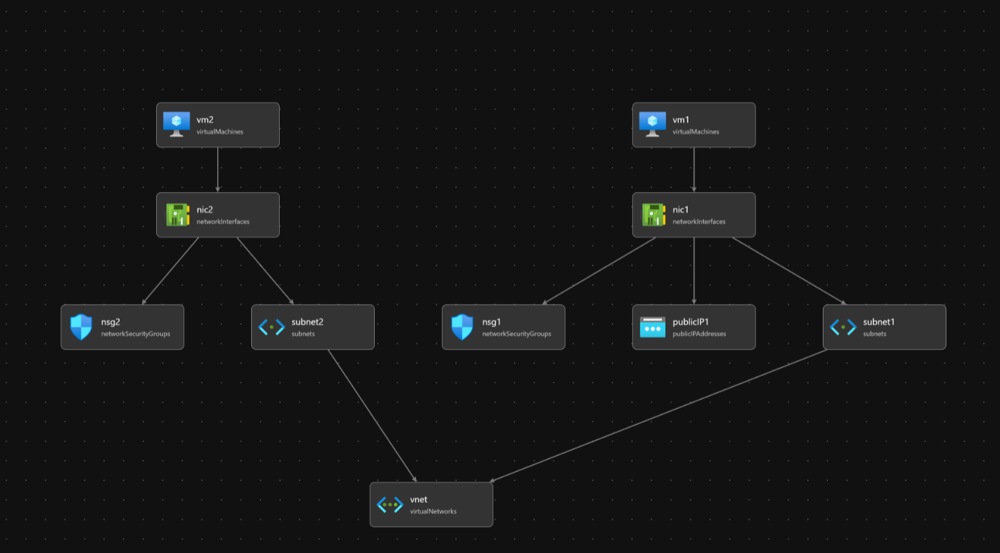

# Build a network with Bicep

In this session we're going to build a virtual network in Azure with 2 subnets, 2 virtual machines, and 2 network security groups.

## Resources

- [Azure Bicep templates vnet two subnets](https://github.com/Azure/azure-quickstart-templates/blob/master/quickstarts/microsoft.network/vnet-two-subnets/main.bicep)
- [Azure Bicep templates vm-simple-linux](https://github.com/Azure/bicep/blob/main/docs/examples/101/vm-simple-linux/main.bicep)
- [Azure best practices for network security](https://docs.microsoft.com/en-us/azure/security/fundamentals/network-best-practices#use-strong-network-controls)
- [Azure network security overview](https://docs.microsoft.com/en-us/azure/security/fundamentals/network-overview#network-access-control)
- [Build your first Bicep template](https://aka.ms/AzureVNetsCSC2)

## Architecture diagram

